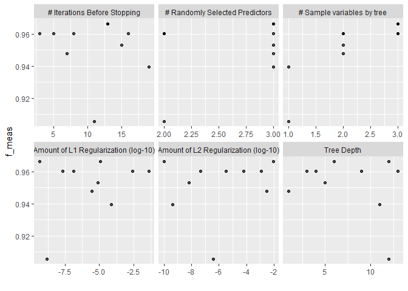

<!-- Ejemplo -->

# tm\_xgboost\_cla

<!-- badges: start -->
<!-- badges: end -->

``` r
library(tidymodels)
library(tidyverse)
source("https://github.com/rafzamb/tm_xgboost_cla/raw/master/xgboost_tune_param.R")
```

``` r
# Particion
cv_folds <- vfold_cv(iris, v = 2)

#Recta
Receta <- recipe(formula = Species ~ ., data =  iris)

# Modelo
xgb <- boost_tree(
  tree_depth = tune(), 
  mtry = tune(),
  stop_iter = tune(),
) %>% 
  set_engine("xgboost", 
             colsample_bytree = tune(),
             lambda = tune(),
             alpha = tune()
  ) %>% 
  set_mode("classification")

#Workflow
xgb_wf <- workflow() %>%
  add_recipe(Receta) %>%
  add_model(xgb)

#Rango de parametros
xgb_param <- 
  xgb %>%
  parameters() %>% 
  update(mtry = mtry(c(2L, 3L)),
         colsample_bytree = colsample_bytree(c(1L, 3L)),
         lambda = penalty_L2(range = c(-10, -1)),
         alpha = penalty_L1(range = c(-10, -1))
  )
```

``` r
#Control de optimizacion Bayes
ctrl <- control_bayes(no_improve = 2, verbose = T, save_pred = T, seed = 123)


xgb_res <- tune_bayes(xgb_wf, 
                      resamples = cv_folds,
                      iter = 3,
                      param_info = xgb_param,
                      metrics = metric_set(f_meas),
                      control = ctrl,
                      initial = 8
)
#> 
#> >  Generating a set of 8 initial parameter results
#> ! Fold1: preprocessor 1/1, model 2/8: `early_stop` was reduced to 14.
#> ! Fold1: preprocessor 1/1, model 6/8: `early_stop` was reduced to 14.
#> ! Fold1: preprocessor 1/1, model 8/8: `early_stop` was reduced to 14.
#> ! Fold2: preprocessor 1/1, model 2/8: `early_stop` was reduced to 14.
#> ! Fold2: preprocessor 1/1, model 6/8: `early_stop` was reduced to 14.
#> ! Fold2: preprocessor 1/1, model 8/8: `early_stop` was reduced to 14.
#> v Initialization complete
#> 
#> Optimizing f_meas using the expected improvement
#> 
#> -- Iteration 1 -----------------------------------------------------------------
#> 
#> i Current best:      f_meas=0.9666 (@iter 0)
#> i Gaussian process model
#> v Gaussian process model
#> i Generating 5000 candidates
#> i Predicted candidates
#> i mtry=3, tree_depth=12, stop_iter=13, colsample_bytree=3, lambda=1.07e-10,
#>   alpha=1.15e-05
#> i Estimating performance
#> v Estimating performance
#> (x) Newest results:  f_meas=0.9666 (+/-0.00394)
#> 
#> -- Iteration 2 -----------------------------------------------------------------
#> 
#> i Current best:      f_meas=0.9666 (@iter 0)
#> i Gaussian process model
#> v Gaussian process model
#> i Generating 5000 candidates
#> i Predicted candidates
#> i mtry=3, tree_depth=3, stop_iter=3, colsample_bytree=3, lambda=0.00124,
#>   alpha=2.21e-08
#> i Estimating performance
#> v Estimating performance
#> (x) Newest results:  f_meas=0.9603 (+/-0.0103)
#> ! No improvement for 2 iterations; returning current results.
```

``` r
autoplot(xgb_res) + theme(legend.position = "top")
```

<!-- -->
